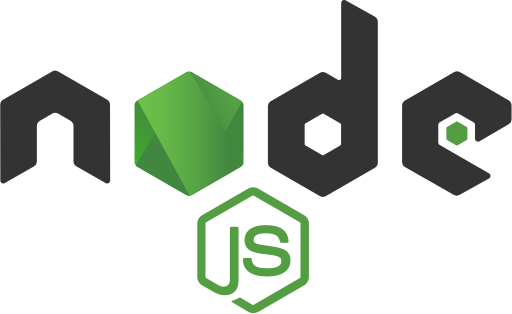

# 🏋️‍♀️ AI Fitness Coach (Workout & Meals)

<div align="center">
  
  
  **Your Personal AI Trainer & Nutrition Expert**
  
  A comprehensive Node.js fitness and nutrition assistant API powered by Ollama's local AI models
  
  [](https://nodejs.org/)
  [](https://expressjs.com/)
  [](https://firebase.google.com/)
  [](https://ollama.ai/)
  [](https://ngrok.com/)
</div>

## 🎯 Overview

**AI Fitness Coach** is a sophisticated workout and meal planning assistant that combines the power of local AI models with comprehensive health databases. Acting as "Coach X," this intelligent system provides personalized, evidence-based fitness training and nutrition guidance while prioritizing user safety through advanced allergy checking and nutritional analysis.

## 🎥 Demo Video

[https://github.com/x3lach/AI-Fitness-Coach-Workout-Meals-.git/assets/demo_test.mp4](https://github.com/x3lach/AI-Fitness-Coach-Workout-Meals-/blob/master/assets/demo_test.mp4)

> **See Coach X in action!** Watch how our AI assistant provides personalized fitness recommendations, nutritional guidance, and safety-first meal planning through intelligent conversations.

## ✨ Key Features

### 🧠 AI-Powered Intelligence
- **Local AI Processing** - Leverages Ollama models for privacy-focused recommendations
- **Contextual Responses** - Sophisticated prompt engineering for personalized guidance
- **Smart Conversations** - Natural language processing for intuitive interactions

### 🍎 Nutrition Management
- **Allergy-Safe Recommendations** - Intelligent ingredient checking and safety alerts
- **Comprehensive Meal Database** - 3000+ meals with detailed nutritional information
- **Macro Analysis** - Detailed breakdowns of proteins, carbs, fats, and calories
- **Meal Time Optimization** - Tailored suggestions for breakfast, lunch, dinner, and snacks

### 💪 Fitness Guidance
- **Personalized Workout Plans** - Custom routines based on fitness level and available equipment
- **Exercise Form Coaching** - Detailed guidance for proper technique and safety
- **Muscle Group Targeting** - Specific recommendations for balanced training
- **Equipment Flexibility** - Workouts adaptable to home, gym, or outdoor settings

### 🔒 Data & Security
- **Firebase Integration** - Secure user data management and authentication
- **Privacy First** - Local AI processing keeps sensitive health data secure
- **RESTful API** - Clean, scalable endpoint architecture

## 🛠 Tech Stack

<div align="center">
  
</div>

- **Backend Framework**: Node.js with Express.js
- **AI Engine**: Ollama (Local AI Models)
- **Database**: Firebase Firestore
- **Authentication**: Firebase Auth
- **Tunneling**: ngrok (for local development and testing)
- **External APIs**: MealDB API, WGER API
- **Data Processing**: Custom nutrition database with JSON storage

## 🚀 Quick Start

### Prerequisites
- Node.js (v14 or higher)
- Ollama installed locally
- ngrok (for tunneling/testing)
- Firebase project setup

### Installation

1. **Clone the repository**
   ```bash
   https://github.com/x3lach/AI-Fitness-Coach-Workout-Meals-.git
   cd AI-Fitness-Coach-Workout-Meals--master
   ```

2. **Install dependencies**
   ```bash
   npm install
   ```

3. **Set up environment variables**
   ```bash
   cp .env.example .env
   # Configure your Firebase credentials and API keys
   ```

4. **Initialize Ollama**
   ```bash
   # Pull your preferred model (e.g., llama2, mistral)
   ollama pull llama2
   ```

5. **Start the server**
   ```bash
   npm start
   ```

6. **Optional: Set up ngrok for external access**
   ```bash
   # In a separate terminal
   ngrok http 3000
   ```

The API will be available at `http://localhost:3000` (or your ngrok URL for external access)

## 📡 API Endpoints

### Chat & Recommendations
```http
POST /api/chat
Content-Type: application/json

{
  "message": "I need a high-protein breakfast recipe",
  "userId": "user123",
  "context": "fitness_goal"
}
```

### Fitness Planning
```http
POST /api/workout-plan
Content-Type: application/json

{
  "fitnessLevel": "intermediate",
  "equipment": ["dumbbells", "resistance_bands"],
  "targetMuscles": ["chest", "back"],
  "duration": 45
}
```

### Nutrition Analysis
```http
POST /api/analyze-meal
Content-Type: application/json

{
  "ingredients": ["chicken breast", "brown rice", "broccoli"],
  "allergies": ["nuts", "dairy"]
}
```

## 🎭 Meet Coach X

Coach X is your intelligent fitness companion designed to:

<div align="center">
  
</div>

- 🎯 **Personalize** recommendations based on your goals and preferences
- 🛡️ **Prioritize** your safety with allergy checks and form guidance  
- 📚 **Educate** you with evidence-based fitness and nutrition knowledge
- 💬 **Converse** naturally about your health journey
- 🔄 **Adapt** suggestions as your fitness level progresses

## 📊 Project Structure

```
ai-fitness-coach/
├── src/
│   ├── controllers/         # API route handlers
│   ├── services/           # Business logic and AI integration
│   ├── models/             # Data models and schemas
│   ├── utils/              # Helper functions and utilities
│   └── config/             # Configuration files
├── data/
│   └── meals_nutrition.json # Comprehensive nutrition database
├── prompts/
│   └── promptTemplates.js  # AI prompt engineering
├── tests/                  # Unit and integration tests
└── docs/                   # API documentation
```

## 🤝 Contributing

We welcome contributions! Please see our [Contributing Guide](CONTRIBUTING.md) for details.

1. Fork the repository
2. Create your feature branch (`git checkout -b feature/AmazingFeature`)
3. Commit your changes (`git commit -m 'Add some AmazingFeature'`)
4. Push to the branch (`git push origin feature/AmazingFeature`)
5. Open a Pull Request

## 📄 License

This project is licensed under the MIT License - see the [LICENSE](LICENSE) file for details.

## 🙏 Acknowledgments

- [Ollama](https://ollama.ai/) for providing local AI model infrastructure
- [MealDB](https://www.themealdb.com/) for nutrition data
- [WGER](https://wger.de/) for exercise information
- [Firebase](https://firebase.google.com/) for backend services


---

<div align="center">
  <p>🌟 Star this repo if you found it helpful!</p>
</div>
